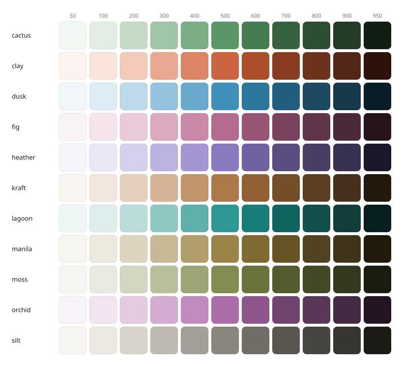

# tailugin

A collection of Tailwind CSS v4 utilities: enter/exit animations, semantic state variants, OKLCH color palettes, and easing tokens — all authored with native v4 directives (`@utility`, `@custom-variant`, `@theme`), so they compose exactly like built-in classes.

[](https://www.npmjs.com/package/tailugin)
[](https://www.npmjs.com/package/tailugin)
[](./LICENSE)

> **Requires Tailwind CSS v4.** tailugin uses the v4 CSS-first architecture. It does not work with v3.

## Installation

```bash
bun add tailugin
# or
npm install tailugin
```

## Usage

Import Tailwind, then tailugin, in your entry CSS:

```css
@import "tailwindcss";
@import "tailugin";
```

That's the whole setup. Everything below is now available as utility classes and variants.

Prefer to pull in only what you need? Every module has its own entry point — see [Granular imports](#granular-imports).

## Modules

tailugin is organized into four independent modules:

| Module        | What it adds                         | Import               |
| ------------- | ------------------------------------ | -------------------- |
| **theme**     | 11 color palettes + 22 easing tokens | `tailugin/theme`     |
| **variants**  | 21 semantic state variants           | `tailugin/variants`  |
| **utilities** | Enter/exit animation utilities       | `tailugin/utilities` |
| **preflight** | Typographic refinements              | `tailugin/preflight` |

---

## Colors

11 OKLCH palettes, each with an 11-step ramp (`50`–`950`). They **add to** Tailwind's default colors — nothing native is overwritten, so `bg-blue-500` and `bg-cactus-500` coexist.



```html
<div class="bg-cactus-500 text-clay-50 border-dusk-200">…</div>
```

Available palettes: `cactus`, `clay`, `dusk`, `fig`, `heather`, `kraft`, `lagoon`, `manila`, `moss`, `orchid`, `silt`.

Every palette shares the same lightness scale, so swapping one for another keeps contrast consistent across your UI.

---

## Animations

Enter/exit animations built on two base utilities — `animate-in` and `animate-out` — combined with modifier utilities that describe the motion.

```html
<!-- A popover that fades, zooms, and slides in from the top -->
<div class="animate-in fade-in zoom-in slide-in-top-2 duration-200">…</div>
```

### How it works

`animate-in` / `animate-out` are the triggers — they start the animation. The modifiers (`fade-in`, `zoom-in`, `slide-in-top-*`, …) only describe _how_ the element moves; on their own they do nothing until a trigger runs. This means you can put the modifiers on the element unconditionally and only toggle the trigger:

```html
<div
  class="fade-in slide-in-top-2 fade-out slide-out-top-2
         is-open:animate-in is-closed:animate-out duration-200"
>
  …
</div>
```

The state prefix appears twice (on the triggers), not on every modifier.

### Timing

Duration and easing use Tailwind's **native** utilities — no special classes needed:

```html
<div class="animate-in fade-in duration-300 ease-out-expo">…</div>
```

- `duration-*` — sets the animation duration (defaults to `150ms`).
- `ease-*` — sets the timing function (see [Easings](#easings)).
- `delay-*` — sets the animation delay.

### Modifiers

Each modifier works without a value (using a sensible default) or with one for full control.

| Utility                             | Without value      | With value                                     |
| ----------------------------------- | ------------------ | ---------------------------------------------- |
| `fade-in` / `fade-out`              | opacity from `0`   | `fade-in-90` (from 90%), `fade-in-[0.7]`       |
| `zoom-in` / `zoom-out`              | scale from `0.95`  | `zoom-in-50`, `zoom-in-[0.8]`                  |
| `blur-in` / `blur-out`              | blur `4px`         | `blur-in-8`, `blur-in-[2px]`                   |
| `spin-in` / `spin-out`              | _requires a value_ | `spin-in-90`, `-spin-in-45`, `spin-in-[30deg]` |
| `slide-in-{top,bottom,left,right}`  | _requires a value_ | `slide-in-top-8`, `slide-in-left-[3rem]`       |
| `slide-out-{top,bottom,left,right}` | _requires a value_ | `slide-out-top-8`                              |

> **Naming:** `in` means _where it comes from_, `out` means _where it goes to_. `slide-in-top` enters from above; `slide-out-top` exits upward.

### Controls

| Utility                                                  | Sets                        |
| -------------------------------------------------------- | --------------------------- |
| `fill-mode-{none,forwards,backwards,both}`               | `animation-fill-mode`       |
| `direction-{normal,reverse,alternate,alternate-reverse}` | `animation-direction`       |
| `repeat-{n,infinite}`                                    | `animation-iteration-count` |
| `play-state-{running,paused}`                            | `animation-play-state`      |

### Reduced motion

`animate-in` and `animate-out` respect `prefers-reduced-motion: reduce` automatically — animation is disabled for users who ask for less motion.

---

## Variants

Semantic state variants that match native, `data-*`, and ARIA attributes at once — so they work across headless UI libraries (Radix, Ark, React Aria, Base UI) without configuration.

```html
<div data-state="open" class="is-open:opacity-100 is-closed:opacity-0">…</div>
<li aria-selected="true" class="selected:bg-fig-100">…</li>
```

Variants whose name matches a native Tailwind variant are prefixed with `is-` (so they **extend** rather than override the native one). The rest use plain names because no native variant exists.

| Group       | Variants                                                       |
| ----------- | -------------------------------------------------------------- |
| Interaction | `is-disabled`, `dragging`                                      |
| Disclosure  | `is-open`, `is-closed`                                         |
| Selection   | `highlighted`, `selected`, `unchecked`, `pressed`, `on`, `off` |
| Form        | `is-invalid`, `is-required`                                    |
| Navigation  | `current-page`, `current-step`                                 |
| Orientation | `horizontal`, `vertical`                                       |
| Calendar    | `today`, `unavailable`, `range-start`, `range-end`             |
| Theme       | `dark`                                                         |

> `is-open` / `is-disabled` extend the native `open:` / `disabled:` to cover `data-*` and ARIA state on non-native elements. Use the native `open:` / `disabled:` for plain HTML; these for headless components.

---

## Easings

22 easing tokens exposed via `@theme`, so they become `ease-*` utilities automatically and work with any transition or animation:

```html
<button class="transition ease-out-expo">…</button>
<div class="animate-in fade-in ease-anticipate">…</div>
```

Available: `anticipate`, `quick-out`, `in-out`, `in-out-base`, and the `in`/`out`/`in-out` sets for `quad`, `cubic`, `quart`, `quint`, `expo`, and `circ` (e.g. `ease-in-quad`, `ease-out-expo`, `ease-in-out-circ`).

> **Note:** tailugin redefines the native `ease-in-out` token with a refined curve. If you rely on Tailwind's default `ease-in-out`, be aware it is overridden.

---

## Preflight

Optional typographic refinements layered on top of Tailwind's own Preflight (which still handles the reset). Adds automatic hyphenation, balanced headings, pretty paragraph wrapping, tabular numerals, and code ligatures.

```css
@import "tailwindcss";
@import "tailugin/preflight";
```

It only adds what Preflight doesn't cover — no reset is duplicated. Unsupported properties are ignored by the browser without breaking layout.

---

## Granular imports

Import only the modules — or sub-modules — you need:

```css
@import "tailugin/theme"; /* colors + easings */
@import "tailugin/variants"; /* all variants */
@import "tailugin/utilities"; /* all animations */
@import "tailugin/preflight";

/* Sub-modules */
@import "tailugin/theme/colors";
@import "tailugin/theme/easings";
@import "tailugin/utilities/animate";
@import "tailugin/variants/calendar";

/* A single color palette */
@import "tailugin/colors/fig";
```

## License

[MIT](./LICENSE) © [meluiz](https://meluiz.com)
